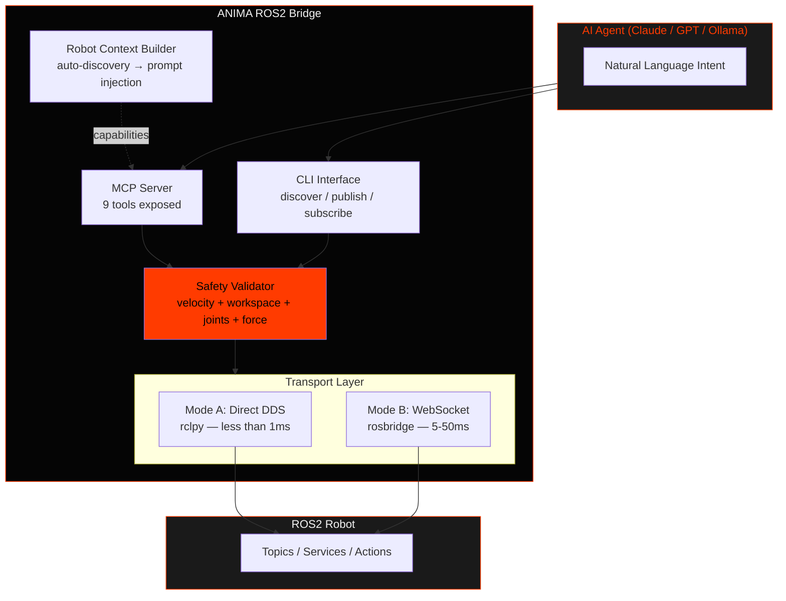
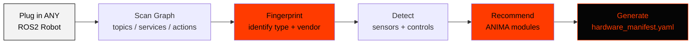
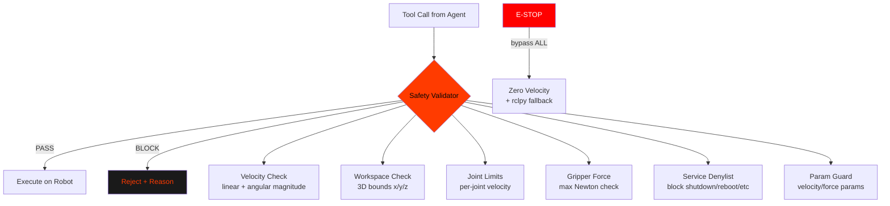
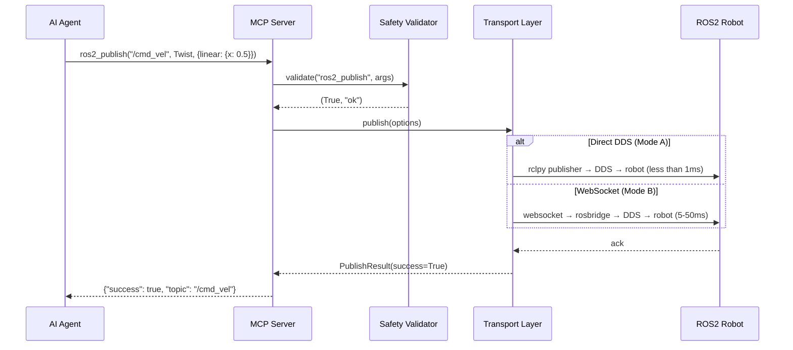
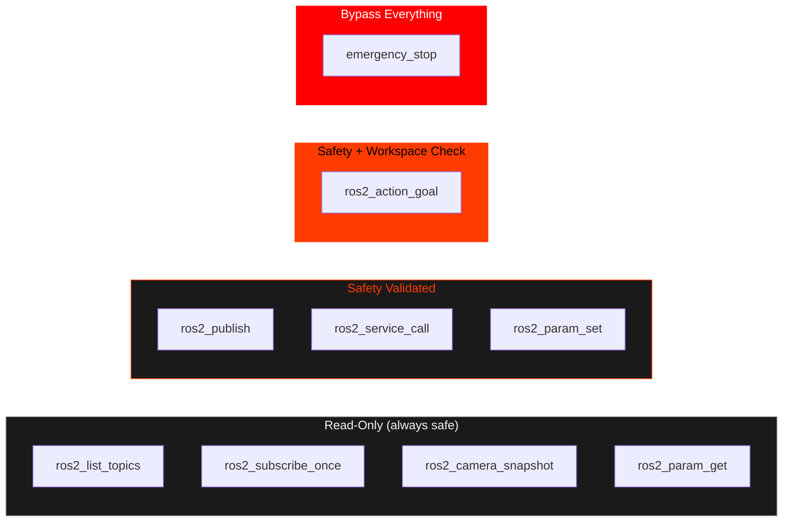
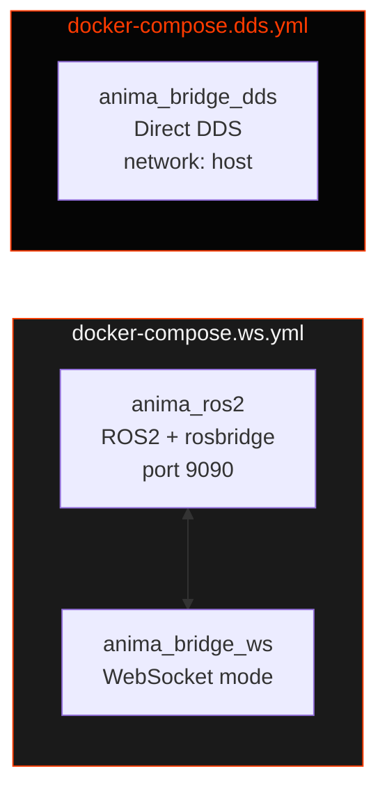

# ANIMA ROS2 Bridge

> **Direct DDS + WebSocket bridge between AI agents and ROS2 robots.**
> The fastest path from natural language to robot action.

[](https://www.python.org/)
[](https://docs.ros.org/en/humble/)
[]()
[](LICENSE)

**Copyright (c) 2026 AIFLOW LABS LIMITED / [RobotFlowLabs](https://robotflowlabs.com)**

---

## Overview

ANIMA ROS2 Bridge connects AI agents to ROS2 robots with two transport modes:

| Mode | Transport | Latency | Use Case |
|------|-----------|---------|----------|
| **Direct DDS** | rclpy → CycloneDDS | **<1ms** | Production, same network |
| **WebSocket** | rosbridge v2 | 5-50ms | Universal, any network |

Switch with one env var. No code changes.

```bash
# Direct DDS — production speed
docker compose -f docker/docker-compose.dds.yml up

# WebSocket — universal compatibility
docker compose -f docker/docker-compose.ws.yml up
```

---

## Architecture



---

## Smart Discovery Engine



Auto-identifies 15+ robot vendors including Unitree, LimX Dynamics, Boston Dynamics, UFactory, Franka, Clearpath, and more. Detects sensors (RGB, depth, LiDAR, IMU, F/T), control interfaces (velocity, joints, Nav2, MoveIt, gripper), and recommends which ANIMA modules to use.

---

## Safety Architecture



Every tool call passes through the SafetyValidator before reaching ROS2. The emergency stop has a dedicated rclpy fallback path that works even when the main transport is down.

---

## Data Flow



---

## CLI Reference

```bash
# Start MCP server for AI agents
anima-bridge serve                              # stdio mode (default)
anima-bridge serve --mode sse --port 8765       # SSE mode

# Auto-discover robot
anima-bridge discover                           # Human-readable report
anima-bridge discover --manifest                # YAML hardware manifest

# Publish to topic
anima-bridge publish /cmd_vel geometry_msgs/msg/Twist '{"linear":{"x":0.5}}'

# Read one message
anima-bridge subscribe /odom --timeout 5000

# List topics
anima-bridge topics

# Call service
anima-bridge service /trigger_save --type std_srvs/srv/Trigger

# Capture camera frame
anima-bridge camera --output frame.jpg
anima-bridge camera --topic /camera/depth/image_raw

# Emergency stop
anima-bridge estop
anima-bridge estop --namespace /go2

# Transport status
anima-bridge status

# Transport selection (via args or env)
anima-bridge --transport direct_dds discover
anima-bridge --transport rosbridge --url ws://robot:9090 topics
```

---

## MCP Tools



| Tool | Safety | Description |
|------|--------|-------------|
| `ros2_publish` | Validated | Publish to any ROS2 topic |
| `ros2_subscribe_once` | Read-only | Read one message with timeout |
| `ros2_service_call` | Validated + denylist | Call any ROS2 service |
| `ros2_action_goal` | Validated + workspace | Send action goal with feedback |
| `ros2_param_get` | Read-only | Get node parameter |
| `ros2_param_set` | Validated + param guard | Set node parameter |
| `ros2_camera_snapshot` | Read-only | Capture camera frame (base64) |
| `ros2_list_topics` | Read-only | Discover available topics |
| `emergency_stop` | Bypass all | Zero all velocities immediately |

---

## Configuration

All settings via environment variables (Docker-friendly):

| Variable | Default | Description |
|----------|---------|-------------|
| `ANIMA_TRANSPORT_MODE` | `direct_dds` | `direct_dds` or `rosbridge` |
| `ANIMA_ROSBRIDGE_URL` | `ws://localhost:9090` | WebSocket URL |
| `ANIMA_DDS_DOMAIN_ID` | `0` | ROS2 DDS domain |
| `ANIMA_ROBOT_NAME` | `Robot` | Robot name for context |
| `ANIMA_ROBOT_NAMESPACE` | `` | ROS2 namespace prefix |
| `ANIMA_MAX_LINEAR_VELOCITY` | `1.0` | Max linear speed (m/s) |
| `ANIMA_MAX_ANGULAR_VELOCITY` | `1.5` | Max angular speed (rad/s) |
| `ANIMA_LOG_LEVEL` | `INFO` | Logging level |
| `ANIMA_MCAP_ENABLED` | `false` | Enable MCAP recording |

---

## Docker



```bash
# WebSocket mode (includes ROS2 + rosbridge)
docker compose -f docker/docker-compose.ws.yml up

# Direct DDS mode (connects to host ROS2)
docker compose -f docker/docker-compose.dds.yml up

# Development mode (live reload)
docker compose -f docker/docker-compose.ws.yml -f docker/docker-compose.dev.yml up
```

---

## Project Structure

```
anima-ros2-bridge/
├── anima_bridge/                  # Main Python package (6,562 LOC)
│   ├── __main__.py                # Entry point (env + CLI config)
│   ├── cli.py                     # Full CLI (discover/publish/subscribe/...)
│   ├── config.py                  # Pydantic v2 configuration
│   ├── mcp_server.py              # MCP server (9 tools for AI agents)
│   ├── openclaw_plugin.py         # OpenClaw compatibility wrapper
│   ├── transport_manager.py       # Transport singleton + switching
│   ├── discovery/                 # Smart Discovery Engine
│   │   ├── fingerprint.py         # Robot type + vendor identification
│   │   └── scanner.py             # Capability scanner + health monitoring
│   ├── tools/                     # 7 ROS2 tools
│   │   ├── ros2_publish.py
│   │   ├── ros2_subscribe.py
│   │   ├── ros2_service.py
│   │   ├── ros2_action.py
│   │   ├── ros2_param.py
│   │   ├── ros2_introspect.py
│   │   └── ros2_camera.py
│   ├── safety/                    # Safety validator
│   │   └── validator.py           # Velocity + workspace + joints + force + denylist
│   ├── context/                   # Robot context builder
│   │   └── robot_context.py       # Auto-discovery → agent prompt injection
│   ├── commands/                  # Direct commands
│   │   ├── estop.py               # Emergency stop (with rclpy fallback)
│   │   └── transport_cmd.py       # Runtime transport switching
│   └── transport/                 # Transport abstraction
│       ├── types.py               # Shared types
│       ├── base.py                # AnimaTransport ABC
│       ├── entity_cache.py        # Thread-safe entity caching
│       ├── direct_dds.py          # Mode A: rclpy Direct DDS
│       ├── factory.py             # Transport factory
│       └── rosbridge/             # Mode B: WebSocket
│           ├── client.py          # WS client + auto-reconnect
│           └── adapter.py         # RosbridgeTransport
├── anima_msgs/                    # Custom ROS2 messages
│   ├── msg/AnimaCapabilities.msg  # Rich capability manifest
│   └── srv/GetCapabilities.srv    # On-demand capability query
├── anima_discovery/               # ROS2 discovery node
│   └── discovery_node.py          # Periodic capability publisher
├── sim/                           # Simulation models
│   ├── TRON1/                     # LimX TRON1 biped (URDF + MJCF)
│   └── tron1_urdf/                # Multiple variants (PF/WF/SF)
├── docker/                        # Docker infrastructure
│   ├── docker-compose.ws.yml      # WebSocket mode
│   ├── docker-compose.dds.yml     # Direct DDS mode
│   ├── docker-compose.dev.yml     # Dev overrides
│   ├── Dockerfile.ros2            # ROS2 base image
│   └── Dockerfile.bridge          # Bridge image
├── tests/                         # 74 tests, 100% passing
│   └── unit/
│       ├── test_config.py
│       ├── test_transport_types.py
│       ├── test_safety_validator.py
│       └── test_tools.py
└── pyproject.toml                 # Python 3.14, uv, ruff, mypy
```

---

## Testing

```bash
# Unit tests (no ROS2 required)
uv run pytest tests/ -v

# Lint
ruff check anima_bridge/ tests/

# Format
ruff format anima_bridge/ tests/
```

**Current**: 74 tests passing, 0 ruff errors, all files under 480 lines.

---

## OpenClaw Compatibility

The bridge can be loaded as an OpenClaw plugin for multi-channel AI agent deployments:

```python
from anima_bridge.openclaw_plugin import get_plugin

plugin = get_plugin(config)
tools = plugin.get_tool_definitions()      # 9 tools for OpenClaw
context = await plugin.before_agent_start() # Robot capabilities
```

---

## Part of ANIMA

This bridge is a component of **ANIMA** — the Robotics Intelligence Compiler by AIFLOW LABS LIMITED.

**A**utonomous **N**eural **I**ntelligence for **M**achine **A**wareness

> "Compiles intelligence into speed."

Learn more at [robotflowlabs.com](https://robotflowlabs.com)

---

*Built with AI agents. Powered by ROS2. Made for robots.*
*Copyright (c) 2026 AIFLOW LABS LIMITED / RobotFlowLabs. All rights reserved.*
