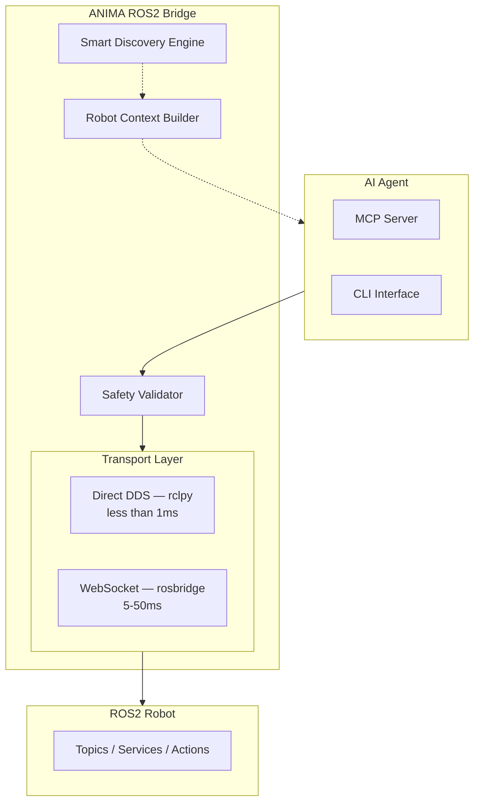
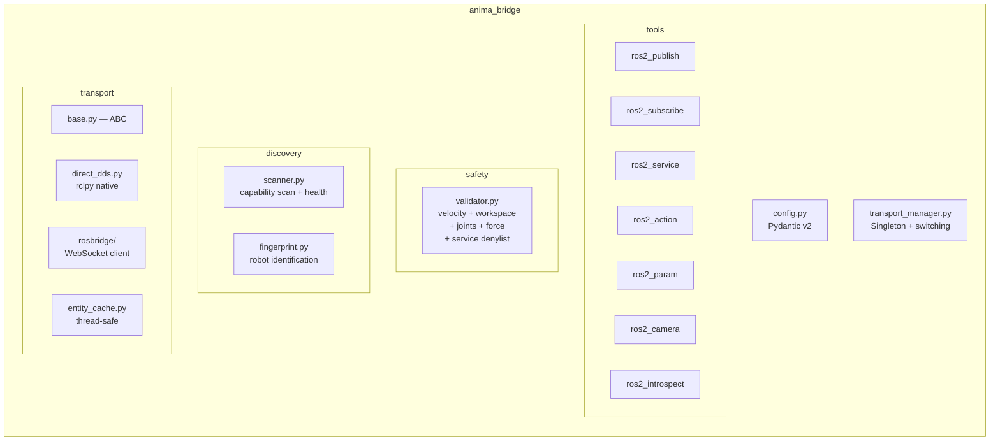
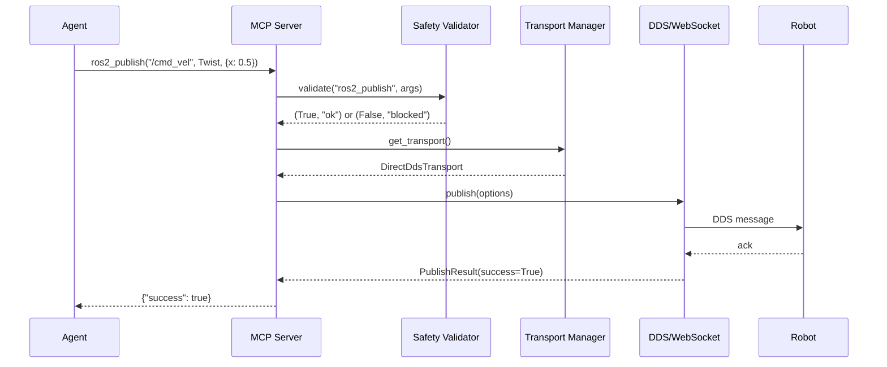
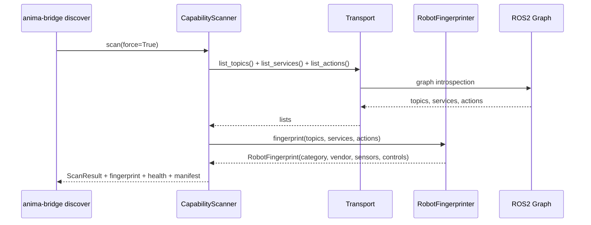

# Architecture

> Copyright (c) 2026 AIFLOW LABS LIMITED / RobotFlowLabs. All rights reserved.

## Overview

ANIMA ROS2 Bridge is a two-transport bridge between AI agents and ROS2 robots.



## Transport Modes

### Mode A: Direct DDS (Default)

Uses `rclpy` to connect directly to the ROS2 DDS network. Sub-millisecond latency. Requires the bridge to be on the same network as the robot.

```
Agent → AnimaTransport.publish() → rclpy Publisher → CycloneDDS → Robot
```

### Mode B: WebSocket (Rosbridge)

Uses the rosbridge v2 WebSocket protocol. Works over any network. 5-50ms latency depending on payload size.

```
Agent → AnimaTransport.publish() → WebSocket → rosbridge_server → DDS → Robot
```

## Component Diagram



## Data Flow

### Tool Call (e.g., publish velocity)



### Discovery Flow



## Thread Safety

The Direct DDS transport uses two threads:

1. **asyncio event loop** — handles all async calls from tools/CLI
2. **rclpy spin thread** — runs the ROS2 executor in background

Communication between threads uses `asyncio.get_running_loop().call_soon_threadsafe()` for callbacks and `loop.run_in_executor()` for blocking rclpy calls.

All entity caches (publishers, subscribers, service clients) are protected by `threading.Lock`.

## Safety Architecture

Every tool call passes through the `SafetyValidator` before reaching ROS2:

| Check | Tools Affected | What's Validated |
|-------|---------------|------------------|
| Velocity magnitude | `ros2_publish` (Twist) | linear + angular speed vs limits |
| 3D workspace bounds | `ros2_publish` (Pose), `ros2_action_goal` | x/y/z position vs bounds |
| Joint velocity | `ros2_publish` (JointState) | per-joint speed vs limits |
| Gripper force | `ros2_publish` | force vs max_gripper_force |
| Parameter guard | `ros2_param_set` | velocity/force param names |
| Service denylist | `ros2_service_call` | blocked: shutdown, reboot, etc. |
| E-stop | `emergency_stop` | bypasses ALL checks, zeros velocity |

The e-stop has a dedicated rclpy fallback path that works even when the main transport is down.
