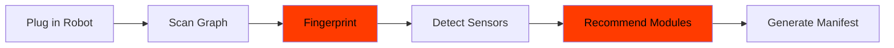

# Smart Discovery Engine

> Copyright (c) 2026 AIFLOW LABS LIMITED / RobotFlowLabs. All rights reserved.

## Overview

ANIMA's discovery engine doesn't just list topics — it **understands** what the robot is.



## What It Detects

### Robot Categories
- `quadruped` — Unitree Go2, Spot, ANYmal
- `humanoid` — Unitree H1/G1, LimX TRON, Fourier GR-1
- `mobile_base` — TurtleBot, Husky, Jackal
- `arm` — xArm, Franka, UR5
- `drone` — PX4, ArduPilot
- `mobile_manipulator` — Stretch, custom setups

### Sensor Types (15 types)
RGB camera, depth camera, stereo camera, 2D LiDAR, 3D LiDAR, IMU, force/torque, joint states, odometry, GPS, battery, audio, tactile, radar, UWB

### Control Interfaces (6 types)
Velocity (Twist), joint position, joint trajectory, Nav2, MoveIt, gripper

### Vendor Identification (15+ vendors)
Unitree, Boston Dynamics, LimX Dynamics, UFactory, Franka, Universal Robots, Kinova, Clearpath, Hello Robot, DEEP Robotics, Xiaomi, AgileX, and more.

## Usage

### CLI

```bash
# Full discovery report
anima-bridge discover --transport rosbridge --url ws://localhost:9090

# Generate hardware_manifest.yaml
anima-bridge discover --manifest > hardware_manifest.yaml
```

### Python

```python
from anima_bridge.discovery.scanner import CapabilityScanner

scanner = CapabilityScanner(namespace_filter="/go2")
result = await scanner.scan(force=True)

# Robot fingerprint
fp = result.fingerprint
print(f"Robot: {fp.vendor_hint} {fp.model_hint}")
print(f"Category: {fp.category}")
print(f"Sensors: {[s.sensor_type for s in fp.sensors]}")
print(f"Recommended: {fp.recommended_modules}")

# Health monitoring
healthy = scanner.get_healthy_topics()
degraded = scanner.get_degraded_topics()

# Auto-generate manifest
yaml = scanner.generate_manifest_yaml(result)
```

## Module Recommendations

Based on detected sensors, the engine recommends ANIMA modules:

| Sensor | Recommended Modules |
|--------|-------------------|
| RGB Camera | AZOTH (detection), MONAD (segmentation), LOGOS (VLM tracking) |
| Depth Camera | CHRONOS (depth), ABYSSOS (metric depth) |
| Stereo Camera | PRISM (3D SLAM), LOCI (place recognition) |
| 3D LiDAR | NEXUS (semantic 3D), PRISM (SLAM), HERMES (navigation) |
| 2D LiDAR | HERMES (navigation) |
| IMU | GNOMON (odometry fusion) |
| Force/Torque | HAPTOS (tactile), DAEDALUS (manipulation) |
| Joint States | DAEDALUS (manipulation), PYGMALION (VLA) |

## Health Monitoring

The scanner tracks topic health over time:

| Status | Meaning |
|--------|---------|
| `healthy` | Publishing at expected rate |
| `degraded` | Rate dropped or intermittent |
| `stale` | No data for > threshold |
| `dead` | No data for > 3x threshold |
