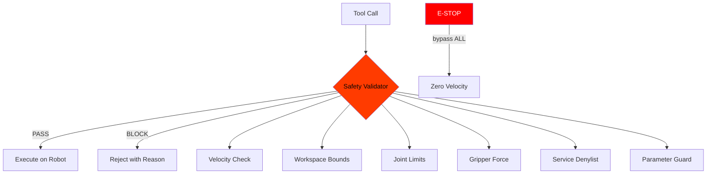

# Safety System

> Copyright (c) 2026 AIFLOW LABS LIMITED / RobotFlowLabs. All rights reserved.

## Overview

Every command passes through the SafetyValidator before reaching the robot. This is a pre-execution gate — not a runtime monitor.



## Configuration

```yaml
# Via environment variables
ANIMA_MAX_LINEAR_VELOCITY=1.0      # m/s
ANIMA_MAX_ANGULAR_VELOCITY=1.5     # rad/s
ANIMA_MAX_GRIPPER_FORCE=40.0       # N

# Via Python config
from anima_bridge.config import SafetySettings, WorkspaceLimits

safety = SafetySettings(
    max_linear_velocity=1.0,
    max_angular_velocity=1.5,
    workspace_limits=WorkspaceLimits(
        x_min=-5.0, x_max=5.0,
        y_min=-5.0, y_max=5.0,
        z_min=0.0, z_max=2.0,
    ),
    joint_velocity_limits={
        "shoulder": 2.0,
        "elbow": 3.0,
    },
    max_gripper_force=40.0,
    watchdog_timeout_ms=500,
)
```

## Checks

### 1. Velocity (ros2_publish — Twist messages)

Checks the Euclidean magnitude of linear and angular velocity vectors.

```python
# This will be BLOCKED:
ros2_publish("/cmd_vel", "geometry_msgs/msg/Twist", {
    "linear": {"x": 5.0}  # 5.0 > max_linear_velocity (1.0)
})
# Result: (False, "Linear velocity 5.00 m/s exceeds limit of 1.0 m/s")
```

### 2. Workspace Bounds (ros2_publish — Pose, ros2_action_goal)

Checks x/y/z position against 3D workspace limits. Works recursively — finds `position` fields at any nesting depth in action goals.

### 3. Joint Velocity (ros2_publish — JointState)

Checks per-joint velocity against configured limits. Only active when `joint_velocity_limits` is configured.

### 4. Gripper Force (ros2_publish)

Checks absolute force value against `max_gripper_force`.

### 5. Service Denylist (ros2_service_call)

Blocks calls to dangerous services matching these patterns:
- `/shutdown`, `/reboot`, `/self_destruct`
- `/factory_reset`, `/format_disk`, `/delete_all`
- `/firmware_update`, `/load_node`, `/unload_node`

### 6. Parameter Guard (ros2_param_set)

Blocks setting velocity/speed/force parameters to values exceeding safety limits.

## Emergency Stop

The e-stop bypasses ALL safety checks and immediately publishes zero velocity:

```bash
anima-bridge estop
```

If the main transport is down, the e-stop has a fallback path that creates a dedicated rclpy publisher to send the stop command directly.

## Adding Custom Checks

```python
from anima_bridge.safety.validator import SafetyValidator
from anima_bridge.config import SafetySettings

validator = SafetyValidator(SafetySettings())
ok, reason = validator.validate("ros2_publish", {
    "msg_type": "geometry_msgs/msg/Twist",
    "message": {"linear": {"x": 0.5}},
})
```
